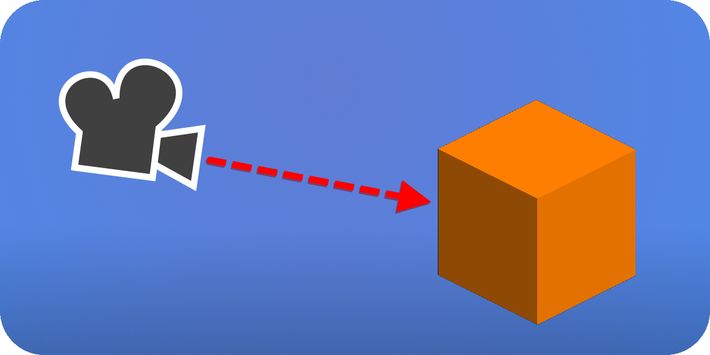

<p align="center" width="100%">
    <h1 align="center"> Introduction  </h1>
</p>

Ray cast is projecting a line from one point to the other, it returns information about the closest object along its path.
This page will focus on how to cast a 3D ray, how to cast a 3D ray forward from a 3D camera and how to read the ray's result information.

<p align="center" width="100%">

</p>

## 3D Space
Every 3D component in godot is automatically assigned to the [World3D class](https://docs.godotengine.org/en/stable/classes/class_world3d.html). <br>
Before casting a ray we need to reference this class:
```cs
public override void _PhysicsProcess(double delta)
{
    var spaceState = GetWorld3D().DirectSpaceState;
}
```
*spaceState represents the interactions of objects and their state in our World3D.*

<br>

## Ray Query
To represent the ray and its properties we will use a [PhysicsRayQueryParameters3D](https://docs.godotengine.org/en/latest/classes/class_physicsrayqueryparameters3d.html):
```cs
public override void _PhysicsProcess(double delta)
{
    var spaceState = GetWorld3D().DirectSpaceState;
    var query = PhysicsRayQueryParameters3D.Create(Vector3.Zero, new Vector3(0,0,50));
}
```

<br>

## Result
Now we can finally cast the ray query inside our spaceState:
```cs
public override void _PhysicsProcess(double delta)
{
    var spaceState = GetWorld3D().DirectSpaceState;
    var query = PhysicsRayQueryParameters3D.Create(Vector3.Zero, new Vector3(0,0,50));
    var result = spaceState.IntersectRay(query);
}
```
The result is a [dictionary](https://learn.microsoft.com/en-us/dotnet/api/system.collections.generic.dictionary-2?view=net-8.0) which contains information about the collider it collided with.<br>
If the ray didn't collide with anything the result will be empty.
```cs
if (result.Count > 0)
    GD.Print("Hit at point: ", result["position"]);
```

### Result Information:

|Type|Information|Description|
|:---|:---|:---|
|Vector2|position|the position where the ray collided.|
|Vector2|normal|which side the collided object's surface(face) is facing.|
|Object|collider|the object the ray collided with.|
|ObjectID|collider_id|object's id|
|RID|rid|object's rid.|
|int|shape|object's shape index.|
|int|face_index|object's face index.|

<br>

## Exclude Collision
When shooting a ray from inside an object the ray *will* detect its collision.<br>
To avoid this issue we can use the Exclude property of our ray query:
```cs
public override void _PhysicsProcess(double delta)
{
    var spaceState = GetWorld3D().DirectSpaceState;
    var query = PhysicsRayQueryParameters3D.Create(Vector3.Zero, new Vector3(0,0,50));
    query.Exclude = new Godot.Collections.Array<Rid> { GetRid() };
    var result = spaceState.IntersectRay(query);
}
```
*The exceptions array can contain objects or RIDs.* <br>
*Note: the 'GetRid()' method only works in classes that inherit from classes like CharacterBody3D, StaticBody3D and more.*

<br>

## Collision Mask
In some cases using the Exception property could become inconvenient when excluding a lot of objects, so instead we can use collision masks.<br>
In this example we ignore layer 2:
```cs
public override void _PhysicsProcess(double delta)
{
    var spaceState = GetWorld3D().DirectSpaceState;
    var query = PhysicsRayQueryParameters3D.Create(Vector3.Zero, new Vector3(0,0,50));
    query.CollisionMask = 4294967295 - 2;
}
```

<br>

## Calculate Collision Mask's Layers
Every layer in a collision mask/layer is represented by a bit, we will focus on two ways to calculate in code which layers we need:

### Calculate with Powers of Two:
Every layer could be represented with 2 by the power of the layer's number *(layer count starts at 0)*:
```cs
Layer 1 is 2^0 = 1
Layer 2 is 2^1 = 2
Layer 3 is 2^2 = 4
Layer 4 is 2^3 = 8
```
If we add all the layers together we will get 4294967295 in decimal.<br>
To ignore layers 2, 3 and 4 for example we will calculate: 4294967295 - 2 - 4 - 8, which equals to 4294967281.<br>
So now we can do:
```cs
query.CollisionMask = 4294967281;
```

### Calculate using bit shifting in a bitmask:
To represent all layers we will write:
```cs
int CollisionLayers = ~0;
```
Now we can decide what layers to ignore by shifting bits *(layer count starts at 0)*:
```cs
~(base_bitmask << layer)

Example:
Layer 1 is ~(1 << 0)
Layer 2 is ~(1 << 1)
Layer 3 is ~(1 << 2)
Layer 4 is ~(1 << 3)
```

Ignore only layer 2:
```cs
int CollisionLayers = ~0;
CollisionLayers = CollisionLayers & ~(1 << 1);
query.CollisionMask = (uint)CollisionLayers;
```
Ignore layers 8 and 16:
```cs
int CollisionLayers = ~0;
CollisionLayers &= ~((1 << 7) | (1 << 15));
query.CollisionMask = (uint)CollisionLayers;
```
[More about bit shifting](https://learn.microsoft.com/en-us/dotnet/csharp/language-reference/operators/bitwise-and-shift-operators)

<br>

## Cast a ray forward from Camera3D
```cs
using Godot;

public partial class RayCast : CharacterBody3D
{
    [Export] Camera3D camera;
    float rayLength = 1000f;

    public override void _PhysicsProcess(double delta)
    {
        var spaceState = GetWorld3D().DirectSpaceState;
        Vector3 cameraPosition = camera.GlobalPosition;
        Vector3 cameraDirection = -camera.GlobalBasis.Z.Normalized();
        var query = PhysicsRayQueryParameters3D.Create(cameraPosition, cameraPosition + cameraDirection * rayLength);
        var result = spaceState.IntersectRay(query);
    }
}
```
*Don't forget to set the exception property so your ray won't intersect with your CharacterBody3D's collision.*

<br>

## Get the ray's intersected object
To get the object that the ray hit we will do: 
```cs
Node obj = (Node)result["collider"];
```
To Get a specific type we can change 'Node' to something else:
```cs
GD.Print(((StaticBody3D)result["collider"]).Name);
```
**BUT in this case if the object isn't a StaticBody3D, this will throw an exception** <br>
So instead of directly converting the type we can use the ['as' operator](https://learn.microsoft.com/en-us/dotnet/csharp/language-reference/operators/type-testing-and-cast): <br>
```cs
StaticBody3D staticObject = (Node)result["collider"] as StaticBody3D;

if (staticObject != null)
	GD.Print(staticObject.Name);
```
The 'as' operator is a safer method, it produces a *null* if the object cannot be converted. <br>
Note: to check if an object can be converted you *can* use the ['is' operator](https://learn.microsoft.com/en-us/dotnet/csharp/language-reference/operators/type-testing-and-cast).<br>

<br>

## Issues and Fixes
- The ray won't cast or it produces an error:<br>
Make sure to cast the ray inside a _PhysicsProcess() method.<br>

- The ray casts to the side from my 3D camera:<br>
Change the cameraDirection's GlobalBasis.<br>

- The ray detects the player's collision:<br>
Set an exclusion to your ray, read the "Exclude Collision" section.<br>

- Error: 'GetRid()' does not exist in the current context:<br>
Change your script's class inheritance to CharacterBody3D or StaticBody3D etc'.<br>
Alternatively you can reference your node as a CharacterBody3D or StaticBody3D.<br>

- Is there an easier way to calculate Layer Masks?<br>
Not that I know of, but you can reference your CharacterBody3D's layers/collision mask.<br>

- Sometimes I receive errors and some other times I don't, how do I get rid of the errors?<br>
Use if statements to validate your types.<br> Incase that is not an option, you can do [Exception handling](https://learn.microsoft.com/en-us/dotnet/csharp/language-reference/statements/exception-handling-statements) to ignore the errors.<br> **Exception handling should be done only if you know what you are doing!**

<br>

### Extra references
[Godot Ray-Casting](https://docs.godotengine.org/en/3.1/tutorials/physics/ray-casting.html?highlight=Ray%20casting) <br>
[Godot RayCast3D](https://docs.godotengine.org/en/stable/classes/class_raycast3d.html) <br>
[Godot Collision Physics](https://docs.godotengine.org/en/stable/tutorials/physics/physics_introduction.html#collision-layers-and-masks) <br>

{{site.date}}
